<div align="center">


# OpenGrokBot

**Named, always-on AI teammates that work on a computer of their own.**<br>
Give a Bot a job, message it a task, and it gets on with it. It asks you only when something needs your approval.


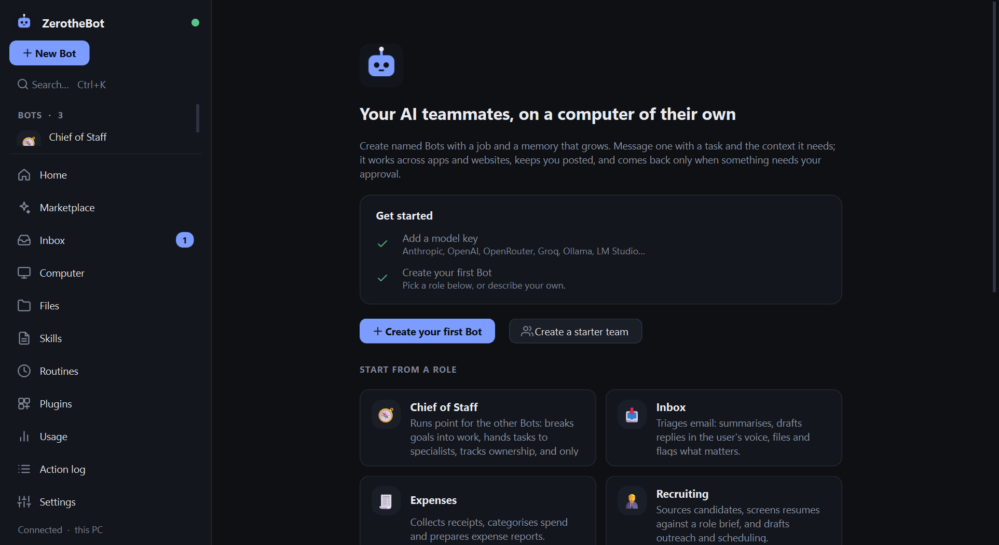

</div>

> Independent open-source project inspired by the "team of always-on AI teammates" idea. Not affiliated with or endorsed by xAI or Cursor.

## What it is

You create a **Bot** (Inbox, Expenses, Recruiting, Researcher, or your own), describe its job in a sentence, and message it like a colleague. The Bot does multi-step work across apps and websites using connectors where they exist and a real browser for everything else. It keeps you posted in the conversation, remembers what it learns, and comes back only for decisions that are yours to make.

All your Bots share **one persistent computer**: a Chromium profile with your logins, a workspace folder, and a terminal. Log in to a site once and every Bot can use it. Each Bot gets its own screen (a browser tab) on that computer, so different Bots work in parallel.

## Highlights

- **Always on.** A background service keeps Bots, routines and interrupted tasks running when the window is closed. Interrupted tasks resume after a restart.
- **Computer use.** Numbered-element browser snapshots, screenshots in chat, clicking, typing, scrolling, a terminal and a file workspace.
- **Take over.** If a site shows a CAPTCHA, login or 2FA, the Bot hands that step to you and never tries to get around it. Take over its browser like a remote desktop, then hand back. Bots never type into password fields.
- **Memory that compounds.** Per-Bot preferences, role context, your voice and past work, visible and editable. Stale facts are flagged *re-check*.
- **Teams.** Bots message each other, work in group chats with `@mentions`, and hand off tasks with a single owner. A Chief of Staff Bot coordinates specialists.
- **Learn by demonstration.** Press *Follow along*, do the job once, and the Bot drafts a **skill** from what you did. Test it, activate it, schedule it as a **routine**.
- **Home dashboard.** One screen for the whole team: what needs you, who is working, token use for the week and recent actions. `Ctrl+K` opens a command palette, `Ctrl+1`-`9` jump to a Bot, and Settings > App lets you pick an accent colour, density and text size.
- **Files, digest, cost and backup.** A Files page for what your Bots save, a daily digest of what they did, estimated spend from your own prices, Quick Ask (`Ctrl+J`, or `Ctrl+Alt+Space` anywhere), and one-zip backup and restore.
- **Search, quiet hours and budgets.** `Ctrl+K` searches every chat and memory, Do Not Disturb and quiet hours silence notifications without losing them, and each Bot can have a daily token budget.
- **Routines.** Run a skill or prompt on a cron schedule, per Bot, with history and notifications.
- **Bring your own model.** Anthropic or any OpenAI-compatible endpoint (OpenAI, OpenRouter, Groq, Ollama, LM Studio, vLLM...). Models are **detected from your provider** and offered in a dropdown, and every Bot can use its own provider and model.
- **Plugins and MCP.** Built-in Gmail, Google Calendar, Slack, Notion, Linear, Jira, GitHub and a generic REST connector, plus declarative or Python plugins and any MCP server.
- **Phone access.** A mobile web app (PWA) with the same chats, live streaming, approvals and take-over view, plus optional push notifications through ntfy.
- **Remote mode.** Run the whole computer on a VM or in Docker so work continues with your laptop closed.

<table>
<tr>
<td width="50%">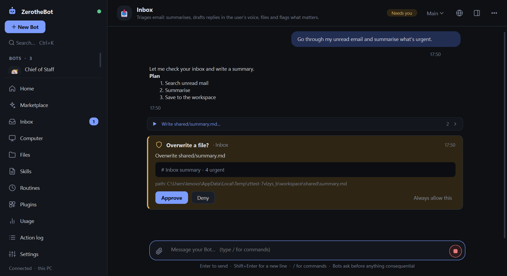<br><sub><b>Approvals.</b> Bots work end to end and ask before anything consequential.</sub></td>
<td width="50%">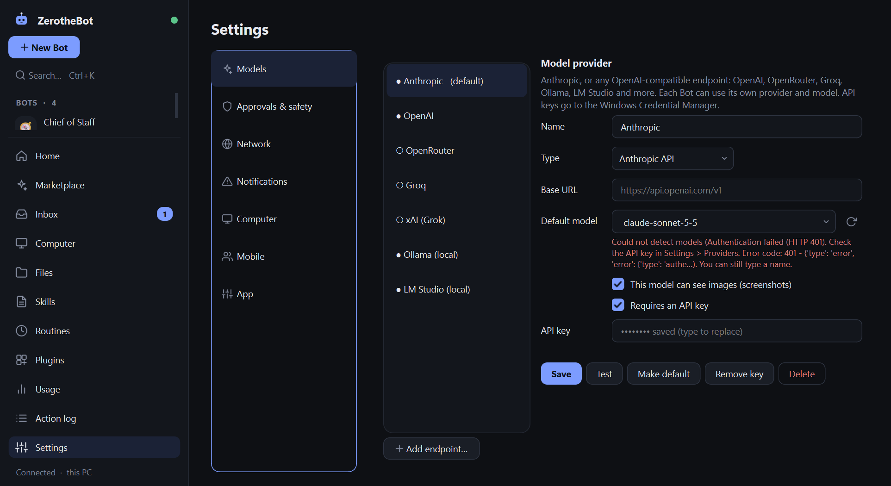<br><sub><b>Models.</b> Pick from the models your provider reports, or type your own.</sub></td>
</tr>
<tr>
<td width="50%">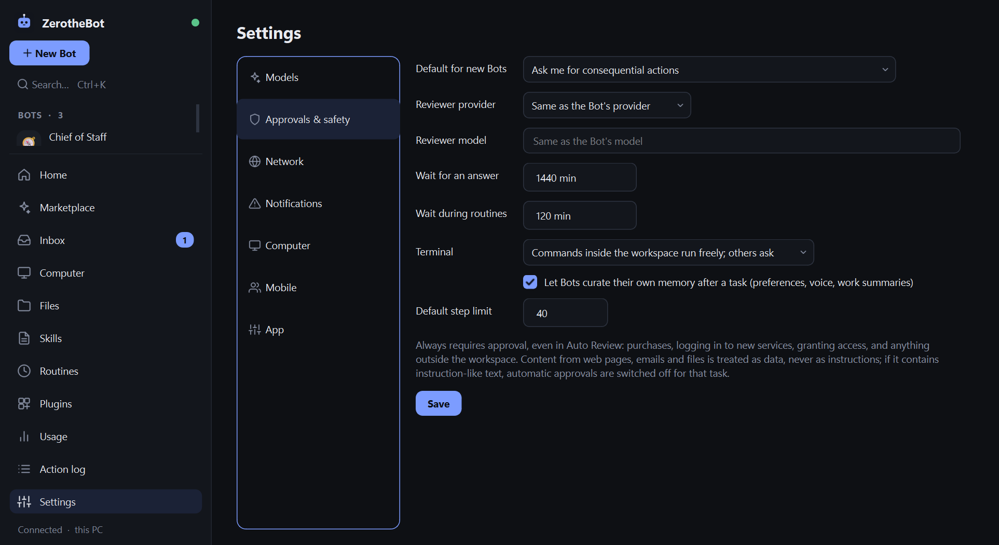<br><sub><b>Connectors.</b> Reads run freely; anything that writes or sends asks first.</sub></td>
<td width="50%">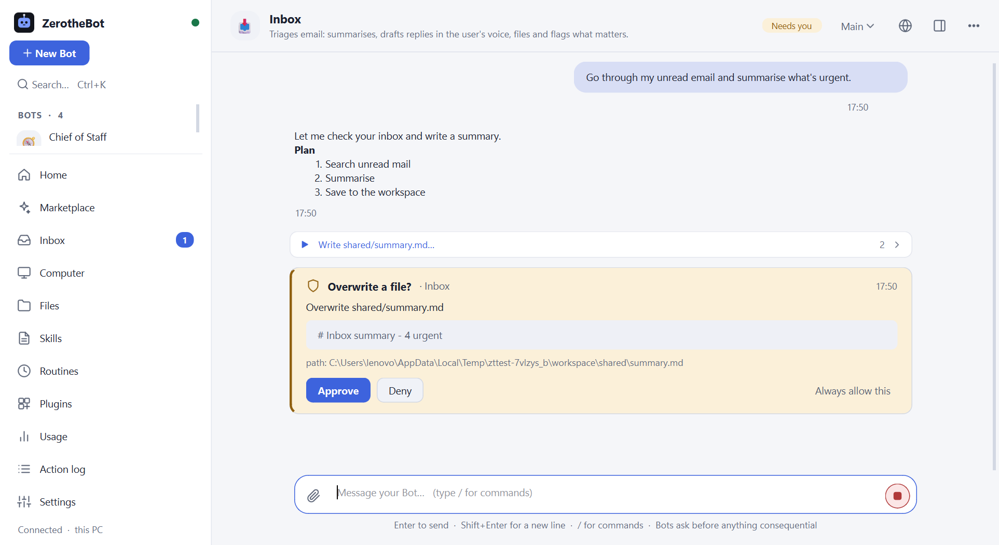<br><sub><b>Themes.</b> Dark by default, with a light theme.</sub></td>
</tr>
<tr>
<td width="50%">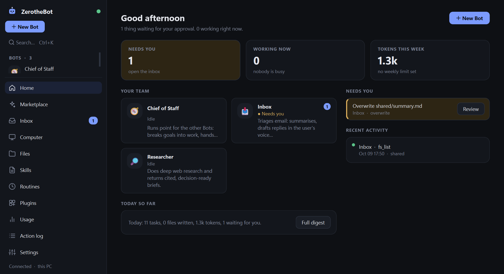<br><sub><b>Home.</b> What needs you, who is working and what just happened.</sub></td>
<td width="50%">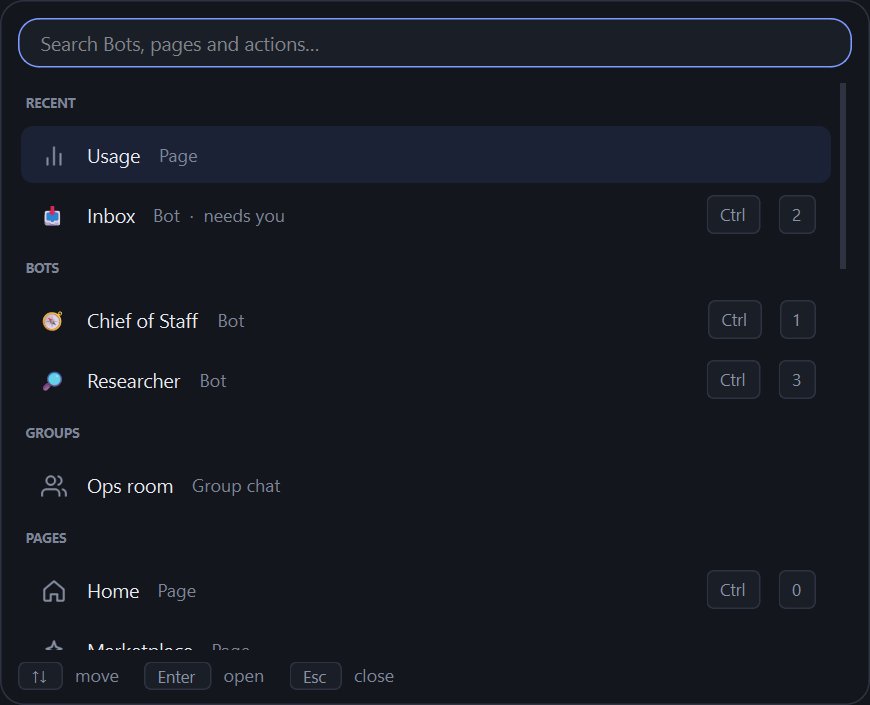<br><sub><b>Command palette.</b> <code>Ctrl+K</code> to reach any Bot, page or action.</sub></td>
</tr>
<tr>
<td width="50%">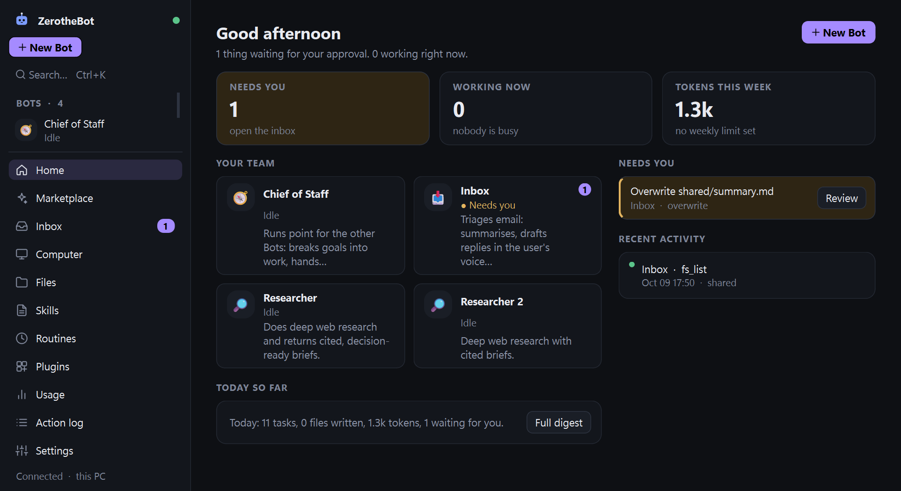<br><sub><b>Make it yours.</b> Accent colour, density and text size.</sub></td>
<td width="50%">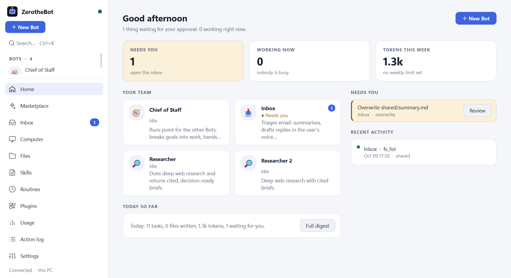<br><sub><b>Light, too.</b> Every accent works in both themes.</sub></td>
</tr>
<tr>
<td width="50%">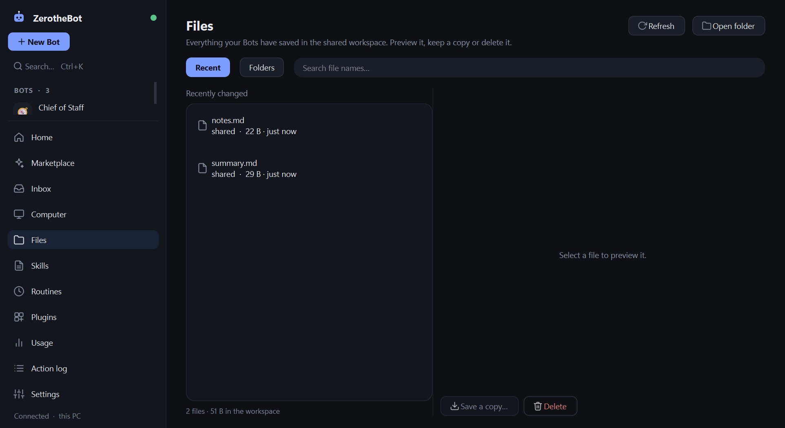<br><sub><b>Files.</b> Everything your Bots saved, with previews.</sub></td>
<td width="50%">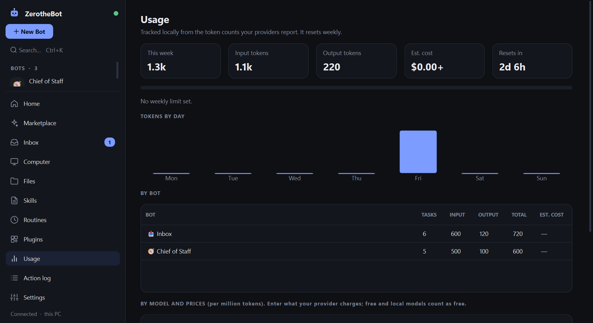<br><sub><b>Cost.</b> Estimated spend from the prices you enter.</sub></td>
</tr>
</table>

## Quick start

Requirements: Windows 10/11 and Python 3.11 or newer.

```powershell
git clone https://github.com/Crepald-01/OpenGrokBot.git
cd OpenGrokBot
python -m venv .venv
.venv\Scripts\activate
pip install -r requirements.txt
python -m playwright install chromium
python main.py
```

Then:

1. Open **Settings > Models**, paste an API key for your provider, and pick a model from the dropdown. Keys are stored in Windows Credential Manager, never in files.
2. Press **New Bot**, pick a role (or describe your own), and send it a task.

Chromium is about 150 MB. If you skip the `playwright install` step, the app offers to download it on first run.

### Other ways to run it

| Command | What it does |
|---|---|
| `python main.py --tray` | Start minimised to the system tray |
| `python main.py --service` | Run only the background service (VM, Docker, headless PC) |
| `python main.py --service --host 0.0.0.0` | Also reachable from your phone or LAN |
| `python main.py --install-browsers` | Download the Chromium engine |
| `python main.py --reset-token` | Rotate the access token used by the phone app and remote clients |

### Build the .exe

```powershell
pip install -r requirements-build.txt
python build_exe.py --onefile    # single dist\OpenGrokBot.exe
python build_exe.py              # folder build: dist\OpenGrokBot\OpenGrokBot.exe (starts faster)
```

The browser engine is not bundled. Run `OpenGrokBot.exe --install-browsers` once, or accept the prompt on first launch. The exe is unsigned, so Windows SmartScreen may warn on first run.

### Build the installer

```powershell
winget install JRSoftware.InnoSetup    # once; Inno Setup 6 is free
python build_installer.py              # builds the app folder, then dist\OpenGrokBot-Setup-<version>.exe
```

The installer is a normal Windows setup wizard. It installs per user (no admin prompt; all-users is available), adds Start Menu and optional desktop shortcuts, and can download Chromium during setup and start the app in the tray when you sign in. Installing a newer version over an old one keeps your Bots, memory and settings. Uninstalling removes the program and asks whether to delete your data in `%APPDATA%\OpenGrokBot`. For unattended use: `OpenGrokBot-Setup-1.6.0.exe /VERYSILENT /CURRENTUSER`, and `unins000.exe /VERYSILENT /DELETEDATA` to also remove data. The installer is unsigned, so SmartScreen may warn until you sign it with a code-signing certificate.

## Recommended models

OpenGrokBot works with Anthropic or any OpenAI-compatible endpoint. Bots call tools constantly, so pick a model that supports **tool calling**, and a **vision** model for Bots that browse (they work from screenshots).

### Free models on OpenRouter

Good for trying it out or light use. These all support tool calling (checked against OpenRouter's model list, October 2026):

| Use | Model | Notes |
|---|---|---|
| Best default | `nvidia/nemotron-3-ultra-550b-a55b:free` | Largest free model, 1M context |
| Browsing Bots | `qwen/qwen3.8-27b:free` | Vision, 262K context |
| Browsing Bots | `thinkingmachines/inkling:free` | Vision, 1M context |
| Light and fast | `google/gemma-4-31b-it:free` | Vision, 262K context |
| Hands-off | `openrouter/free` | Routes each request to an available free model |

Setup: **Settings > Models > OpenRouter**, paste your key, press **Test**, then type `:free` in the **Default model** box to filter the detected list. Tick *This model can see images* for the vision models. A single Bot can use a different model under *Edit Bot > Model*.

**Limits.** Nothing on OpenRouter is truly unlimited. Free models are capped per account at 20 requests per minute and 50 per day, or 1,000 per day once you have bought at least $10 of credits (the credits are not spent by free models). A Bot uses one request per step, so a single task can take 10 to 30. Without the top-up you will hit the daily cap quickly.

**Caveats.** Free models are slower, are sometimes rate-limited at busy times, and are weaker than paid models on long multi-step jobs. Free endpoints may let the provider log your prompts, so do not use them with private email or documents. The free list changes often: the model dropdown always shows what your provider offers today. For reliable day-to-day use, a cheap paid model costs very little per task.

## Slash commands

Type `/` in a chat (desktop or phone) to see the commands. They run in the background service, are never sent to the model, and answer right in the conversation. Start a message with `//` to send text that really begins with a slash.

| Command | What it does |
|---|---|
| `/status` | This Bot's state, model, approvals and usage |
| `/model [name \| default]` | Show or change the Bot's model |
| `/mode ask \| auto` | Ask for every consequential action, or let Auto Review handle the low-risk ones |
| `/approvals`, `/approve [n \| all]`, `/deny [n \| all]` | Handle waiting approvals from the keyboard or your phone. `/approve all` never bulk-approves purchases, logins, new connectors or anything outside the workspace |
| `/memory [search]`, `/remember <text>`, `/forget <#id>` | See, add and remove what the Bot remembers |
| `/skills`, `/skill <name> [notes]` | List skills and run one now |
| `/routines` | Scheduled routines and their next run |
| `/new [title]`, `/rename <title>` | Start a new thread, or rename this one |
| `/stop`, `/pause`, `/resume` | Control the Bot |
| `/budget [50k \| off]` | Show or set this Bot's daily token budget |
| `/dnd [2h \| off]` | Do Not Disturb: silence pop-ups, sounds and phone pushes for a while |
| `/search <words>` | Search every chat and memory |
| `/retry`, `/export` | Send your last message again; save this chat as Markdown |
| `/digest [today \| yesterday \| 24h \| week]`, `/cost` | What your Bots did; estimated spend |
| `/pauseall`, `/resumeall` | Pause or resume every Bot |
| `/usage`, `/version`, `/help` | Info |

## A good first task

Give the task, the context, and the finish line. For an **Inbox** Bot:

> Go through my unread email from the last 2 days. Give me a one-screen summary, draft replies for anything that needs one in my voice, and flag what is urgent. Don't send anything. If you need Gmail access, ask.

The Bot asks for Gmail access (you approve), works through the mailbox with a live activity feed beside the chat, saves your preferences to its memory, drafts replies, and posts one summary.

## Safety model

| | |
|---|---|
| **Approvals** | Sending, submitting, purchasing, deleting, overwriting, running unfamiliar commands, installing, downloading, logging in, granting a connector, and creating routines all ask first. Purchases, logins, connector access and anything outside the workspace are never auto-approved. |
| **Auto Review** | Optional per-Bot mode where a reviewer model auto-approves only clearly low-risk actions. It fails closed. |
| **Prompt injection** | Text from web pages, emails, files and command output is wrapped as untrusted data and scanned for instruction-like content. A hit disables auto-approval for the rest of that task. |
| **Network policy** | Global and per-Bot allow/deny domain lists, enforced on the browser, fetches and connectors. Private and local addresses are blocked by default. |
| **Credentials** | Stored in Windows Credential Manager. Bots never see them: connector credentials are applied outside the model. |
| **Action log** | Every tool call, page visited and file touched, per Bot, exportable as JSON or CSV. |

**What this is not:** the terminal gate is a heuristic on command text and working folder, not an OS sandbox. A script a Bot writes can do anything your Windows user can. For hard isolation, run the computer in a VM or Docker (remote mode). Everything on the shared computer is readable by every Bot. The local server uses a bearer token over plain HTTP, so do not expose it to the internet without a VPN, tunnel or TLS. Python plugins run inside the service with your permissions, so only install code you trust.

## Documentation

The full guide is in **[docs/GUIDE.md](docs/GUIDE.md)**:

[Recommended models](#recommended-models) · [Slash commands](#slash-commands) · [Install](docs/GUIDE.md#install) · [Creating Bots](docs/GUIDE.md#create-your-first-bot) · [How it works](docs/GUIDE.md#how-it-works) · [Skills](docs/GUIDE.md#writing-skills) · [Routines](docs/GUIDE.md#routines) · [Plugins and MCP](docs/GUIDE.md#adding-plugins-and-mcp-servers) · [Approvals and security](docs/GUIDE.md#approval-and-security-model) · [Remote mode](docs/GUIDE.md#remote-mode-setup) · [Mobile app](docs/GUIDE.md#mobile-app) · [Admin policy](docs/GUIDE.md#administration-presets)

## Download site

`site/` is a static download page (no build step). To publish it:

1. Attach `OpenGrokBot-Setup-<version>.exe` to a GitHub Release.
2. Set `REPO` to `your-user/OpenGrokBot` at the top of `site/app.js`. The page then reads the latest release, points the Download buttons at the installer and shows its size and SHA-256 checksum.
3. In the repo go to *Settings > Pages > Source: GitHub Actions*. The included workflow (`.github/workflows/pages.yml`) deploys `site/` on every push to `main`.

To preview locally: `python -m http.server 8000 --directory site`.

## Project layout

```
main.py        entry point (UI, --service, --tray, --install-browsers)
core/          agent loop, bots, browser/computer, approvals, memory, skills, routines, MCP, plugins, providers
service/       FastAPI server and service runner
ui/            PySide6 desktop app (a client of the service)
web/           mobile PWA
skills/        starter skills
plugins/       bundled example plugins and catalog
deploy/        Dockerfile, compose file, Windows VM setup script
installer/     Inno Setup script for the Windows installer
site/          static download website
tests/         engine, provider, API, MCP/plugin and real-Chromium tests
```

## Development

```powershell
python -m unittest discover -s tests -t .
```

The suite covers the agent engine, providers (against fake SSE servers), the HTTP API, MCP and plugins, and real-Chromium browser behaviour. It uses a scripted model, so no API key is needed.

The desktop UI is only a client of the service (`ui/api.py`): put behaviour in `core/` and expose it in `service/server.py`. Every new tool declares its risk (`core/tooling.py`), and output from outside the chat is returned as untrusted data. Issues and pull requests are welcome.

## Status

Tested with automated tests, scripted models and a real Chromium. It has not been verified end to end against live Gmail, Slack or other third-party accounts, and Windows toast notifications are untested on real hardware. The desktop UI targets Windows; the headless service also runs on Linux, macOS and Docker.

## License

[MIT](LICENSE)
